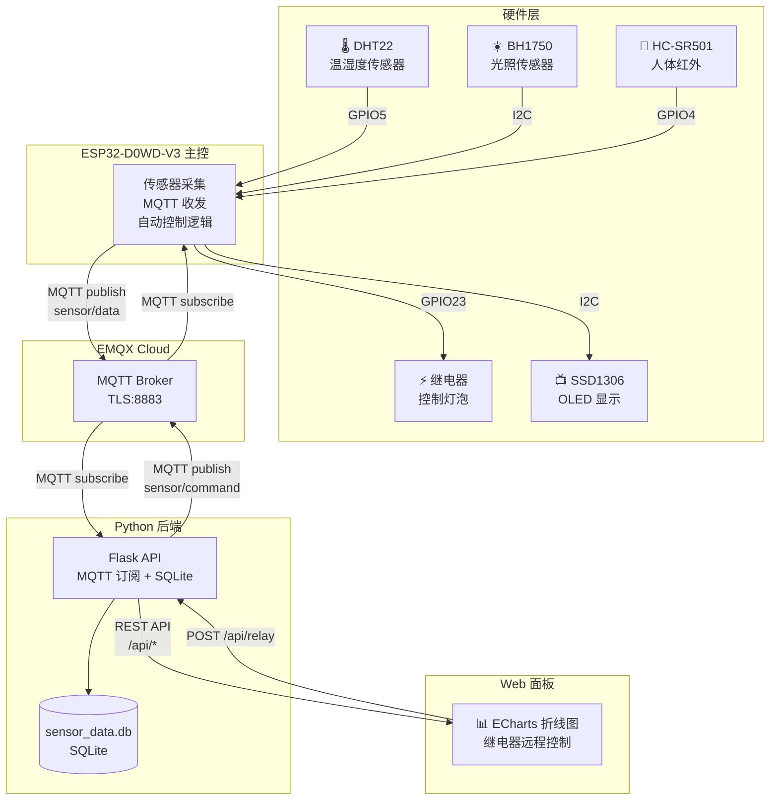

# ESP32 智能家居系统

> 物联网工程 · 项目驱动学习 · 暑假实战项目

---

## 系统架构



**数据流**：
- **上行（采集→展示）**：传感器 → ESP32 读取 → JSON 打包 → MQTT 发布到 `sensor/data` → EMQX Cloud → Python 订阅 → 写入 SQLite → Flask API → Web 面板 ECharts 折线图
- **下行（控制→执行）**：Web 面板按钮 → POST `/api/relay` → Flask 发 MQTT 到 `sensor/command` → EMQX Cloud → ESP32 订阅 → 继电器开关

## 技术栈

| 层级 | 技术 | 说明 |
|------|------|------|
| 硬件 | ESP32-D0WD-V3 | WiFi + 蓝牙双核 MCU，Arduino IDE 开发 |
| 传感器 | DHT22 / BH1750 / HC-SR501 | 温湿度 / 光照 / 人体红外 |
| 执行器 | 5V 继电器模块 | 控制灯泡等外设 |
| 显示 | SSD1306 OLED 0.96" | I2C，128×64，实时显示传感器状态 |
| 通信协议 | MQTT over TLS | EMQX Cloud Serverless，端口 8883 |
| 后端 | Python 3.13 + Flask | MQTT 订阅 + REST API + SQLite 存储 |
| 数据库 | SQLite | 轻量级本地存储，无需额外服务 |
| 前端 | HTML5 + ECharts 5.4 | 响应式 Web 面板，手机可访问 |
| 版本控制 | Git + GitHub Pages | 代码托管 + 工作台 PWA 部署 |

## 硬件清单

| 模块 | 信号引脚 | 供电 | 备注 |
|------|---------|------|------|
| DHT22 温湿度 | GPIO 5 | 3.3V | Adafruit DHT 库 |
| BH1750 光照 | SDA=21, SCL=22 | 3.3V | 与 OLED 共用 I2C |
| HC-SR501 人体红外 | GPIO 4 | 5V | 上电需 10s 预热 |
| 继电器模块 | GPIO 23 | 5V | 高电平触发 |
| OLED SSD1306 | SDA=21, SCL=22 | 3.3V | I2C 地址 0x3C |

> BH1750 和 OLED 共用 I2C 总线（SDA=21, SCL=22）

## 文件结构

```
smart-home-workbench/
│
├── esp32-code/                     # ESP32 端代码（Arduino IDE）
│   ├── mqtt_test/
│   │   └── mqtt_test.ino           # ★ 主程序：传感器采集 + MQTT 收发 + 远程控制
│   ├── oled_display/                # OLED 全传感器显示
│   ├── wifi_test/                   # WiFi 连接测试
│   ├── i2c_scanner/                 # I2C 地址扫描工具
│   ├── sensors_test/                # DHT22 + BH1750 + PIR 基础驱动
│   ├── pir_test/                    # 人体红外单独测试
│   └── relay_test/                  # 继电器单独测试
│
├── python-code/                     # 后端代码
│   ├── flask_api.py                # ★ 主程序：Flask API + MQTT 接收 + SQLite 存储
│   ├── static/
│   │   └── panel.html              # ★ Web 控制面板（ECharts 实时折线图）
│   ├── mqtt_subscriber.py           # MQTT 调试工具（单独订阅）
│   ├── mqtt_to_sqlite.py            # MQTT→SQLite 独立脚本（已被 flask_api 整合）
│   ├── query_data.py                # 数据库查询工具
│   ├── sensor_data.db               # SQLite 数据库（运行时生成）
│   └── emqxsl-ca.crt                # EMQX Cloud CA 证书
│
├── workbench.html                   # 智能家居工作台 PWA（项目进度/存钱/日志）
├── manifest.json                    # PWA 清单
├── sw.js                            # Service Worker
└── README.md                        # 本文件
```

## 快速启动

### 1. 启动后端（电脑）

```bash
cd python-code
python flask_api.py
```

输出：
```
=======================================================
  智能家居系统 — Flask API + MQTT 接收
=======================================================
[DB] 数据库就绪: sensor_data.db
[MQTT] 后台接收线程已启动
[MQTT] 已连接 EMQX Cloud，订阅 sensor/data ...
  面板:    http://localhost:5000/panel
  首页:    http://localhost:5000
  API:     /api/latest  |  /api/history  |  /api/relay  |  /api/stats
=======================================================
```

### 2. 烧录 ESP32（Arduino IDE）

1. 打开 Arduino IDE → 文件 → 打开 `esp32-code/mqtt_test/mqtt_test.ino`
2. 选择开发板：`ESP32 Dev Module`
3. 选择端口：`COM3`
4. 点击上传（→箭头）
5. 上传完成后打开串口监视器（115200 波特率），看到 `MQTT Ready!` 即成功

### 3. 打开面板

- **电脑**：`http://localhost:5000/panel`
- **手机**：确保手机和电脑在同一 WiFi，浏览器打开 `http://<电脑IP>:5000/panel`
- **查看电脑 IP**：终端运行 `ipconfig`，找 IPv4 地址（如 192.168.1.104）

## 配置变量速查

### ESP32 端（mqtt_test.ino）

```cpp
// ===== WiFi =====
const char* WIFI_SSID     = "你的WiFi名";
const char* WIFI_PASSWORD = "你的WiFi密码";

// ===== MQTT =====
const char* MQTT_BROKER   = "b71f890f.ala.cn-shenzhen.emqxsl.cn";
const int   MQTT_PORT     = 8883;        // TLS 加密端口
const char* MQTT_USER     = "esp32";
const char* MQTT_PASS     = "123456";

// ===== 发布间隔 =====
const long PUBLISH_INTERVAL = 2000;     // 2 秒发一次
```

### Flask 端（flask_api.py）

```python
# MQTT 配置（和 ESP32 一致）
MQTT_BROKER = "b71f890f.ala.cn-shenzhen.emqxsl.cn"
MQTT_PORT = 8883
MQTT_USER = "esp32"
MQTT_PASS = "123456"

# Flask
HOST = "0.0.0.0"    # 0.0.0.0 允许局域网访问
PORT = 5000
```

## API 接口

| 方法 | 路径 | 说明 | 返回示例 |
|------|------|------|---------|
| GET | `/api/latest` | 最新一条传感器数据 | `{"ok":true,"data":{"temperature":29.2,"humidity":55.3,...}}` |
| GET | `/api/history?limit=50` | 最近 N 条历史记录（最多 200） | `{"ok":true,"count":50,"data":[...]}` |
| GET | `/api/stats` | 统计（均值/极值/PIR次数） | `{"ok":true,"data":{"total":4400,"temperature":{"avg":29.5,...}}}` |
| POST | `/api/relay` | 继电器控制 | `{"action":"on"}` / `"off"` / `"auto"` |
| GET | `/panel` | Web 控制面板页面 | HTML |

## 继电器控制模式

| 模式 | 命令 | 行为 |
|------|------|------|
| 手动开 | `{"action":"on"}` | 强制开，忽略 PIR |
| 手动关 | `{"action":"off"}` | 强制关，忽略 PIR |
| 自动 | `{"action":"auto"}` | 人体感应自动控制（有人→开，无人→关） |

## 数据格式

ESP32 发布到 `sensor/data` 的 JSON 消息：

```json
{
  "temp": 29.2,
  "humi": 55.3,
  "lux": 120,
  "pir": 0,
  "relay": 0
}
```

## 环境依赖

### ESP32 端
- **Arduino IDE** 2.x
- **ESP32 板支持包**（Boards Manager 搜索 `esp32`）
- **Arduino 库**：
  - `DHT sensor library` (by Adafruit)
  - `BH1750` (by Christopher Laws)
  - `Adafruit SSD1306` + `Adafruit GFX Library`
  - `PubSubClient` (by Nick O'Leary)
- **驱动**：CP2102 USB 转串口驱动

### Python 端
- **Python 3.13+**
- **依赖包**：`flask`、`paho-mqtt`
- 安装：`pip install flask paho-mqtt`

### MQTT Broker
- **EMQX Cloud** Serverless（免费额度）
- 部署区域：cn-shenzhen
- TLS 加密连接（端口 8883）

## 开发历程

| 阶段 | 时间 | 内容 |
|------|------|------|
| Week 1 | 7.28-8.05 | 硬件搭建：传感器驱动、I2C 扫描、OLED 显示 |
| Week 2 | 8.06-8.12 | 联网通信：WiFi 连接、MQTT 上云、Python 订阅 |
| Week 3 | 8.13-8.19 | 数据后端：SQLite 存储、Flask REST API |
| Week 4 | 8.20-8.26 | Web 面板：ECharts 折线图、继电器远程控制 |
| 收尾 | 8.27+ | 代码整理、文档、演示视频 |

---

*最后更新：2026-08-08*
